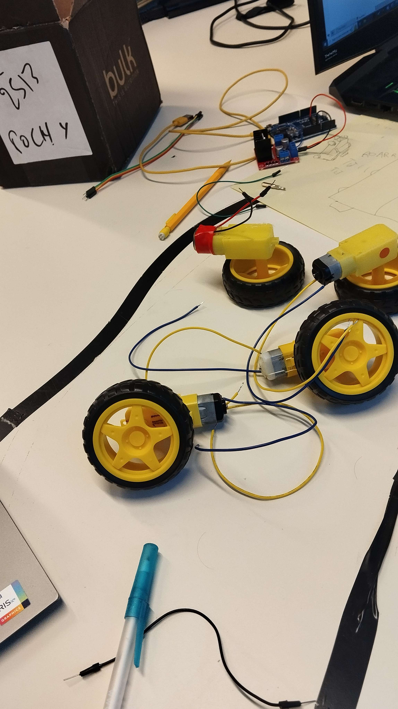

# Rapport sur le Début de Projet Électronique : 4x4 Livreur Tout Terrain

## Contexte

Le projet initial visait la conception d'un 4x4 livreur tout terrain, mais après une évaluation approfondie, nous avons pris la décision de réduire la complexité du projet. Cette révision a été entreprise afin de rendre le projet plus réalisable dans les délais impartis et avec les ressources disponibles.

## Tâches Accomplies

### Acquisition de Compétences en Soudage

J'ai consacré une partie de mon temps à apprendre les techniques de soudage, particulièrement pour les moteurs. Cette compétence nouvellement acquise s'avère essentielle pour l'assemblage et le bon fonctionnement des composants électroniques du véhicule.

### Détermination des Dimensions du Véhicule

Les dimensions du véhicule ont été revues à la baisse pour mieux correspondre à nos capacités et ressources. Cette étape a nécessité une analyse approfondie pour concevoir un modèle viable tout en prenant en compte les contraintes et les objectifs du projet.

### Maîtrise du Logiciel OneShape

Une partie de mon temps a été consacrée à la prise en main du logiciel OneShape pour concevoir la carrosserie du véhicule. Cette phase de conception est cruciale pour aboutir à un design fonctionnel et esthétique.

### Réunion avec les Enseignants pour Évaluer la Faisabilité

La dernière séance était principalement dédiée à une discussion approfondie avec les enseignants, visant à évaluer la faisabilité du projet dans le cadre de nos ressources et compétences. Nous avons échangé sur les avancées, les ajustements nécessaires et les prochaines étapes à suivre.

### Planification de l'Impression 3D

Suite aux recommandations de Monsieur Rallo, nous avons décidé d'opter pour l'impression 3D pour la fabrication de certaines pièces du véhicule. Cette décision a été prise après avoir considéré différentes options, comme l'utilisation de bois pour la carrosserie, qui s'est avérée moins viable.

## Prochaines Étapes

### Finalisation du Design du Véhicule

Le design du véhicule est actuellement en cours et devrait être terminé d'ici la semaine prochaine. Cela permettra de passer à l'étape suivante de la fabrication.

### Lancement de l'Impression 3D

Une fois le design finalisé, je commencerai l'impression 3D des pièces nécessaires à la construction du véhicule, conformément aux conseils de Monsieur Rallo.

### Augmentation de la Productivité

Conscient du léger retard accumulé, je prévois de redoubler d'efforts lors de la prochaine séance pour rattraper ce retard. Cela nécessitera une gestion efficace du temps et une concentration accrue sur les tâches à accomplir.

## Conclusion

En résumé, malgré la réduction du niveau de difficulté du projet, les progrès ont été significatifs, notamment dans l'acquisition de compétences techniques et la planification plus précise des étapes à suivre. Les ajustements effectués visent à garantir la viabilité et la réussite du projet tout en tenant compte des ressources disponibles.

