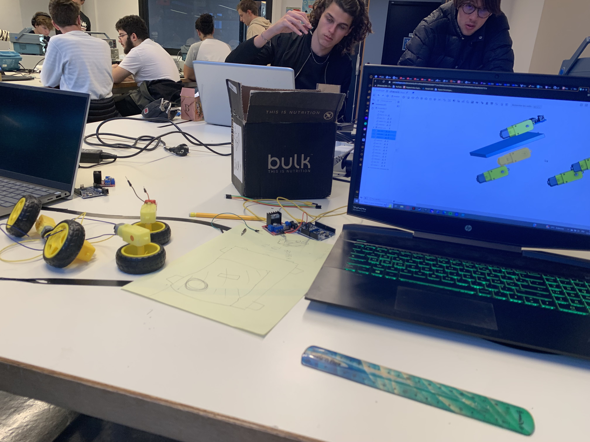

# Rapport de Projet Arduino - Véhicule 4 Roues Motrices Télécommandé par Bluetooth

## Introduction

Lors de notre première séance de travail, nous avons entrepris la réflexion sur la conception d'un véhicule 4 roues motrices pouvant stocker et livrer des cargaisons. Le contrôle de ce véhicule serait assuré via Bluetooth à partir d'un téléphone mobile. Ce rapport documente nos délibérations initiales, les défis rencontrés, et les choix de conception que nous avons opérés.

## Analyse des Ressources Disponibles

Au début du projet, nous avons reçu nos premières pièces et avons évalué le matériel à notre disposition. Nous avons constaté que les composants étaient moins performants que prévu, et ils étaient déjà familiers, ayant été utilisés précédemment en travaux dirigés. Face à cette réalité, nous avons pris la décision de concentrer notre énergie sur d'autres aspects du projet.

## Réajustement des Ambitions

Conscients des limitations matérielles, nous avons consacré un temps significatif à réévaluer nos ambitions. L'idée initiale d'un véhicule tout-terrain a été abandonnée en faveur d'une approche plus réaliste. Nous avons ensuite élaboré plusieurs schémas de châssis et opté finalement pour une modélisation 3D du châssis en vue d'une impression ultérieure. Cette suggestion émanait d'un de nos professeurs, soulignant les avantages d'emboîtement des composants dans le châssis sans recours à la colle.

## Conception du Châssis

Nous avons envisagé un châssis léger et délicat en plastique 3D, renforcé ultérieurement par une planche de bois aux dimensions appropriées. Le châssis en plastique serait solidement fixé au bois à l'aide de vis. Cette approche hybride vise à optimiser la légèreté de l'impression 3D tout en garantissant la robustesse nécessaire pour le bon fonctionnement du véhicule.

## Conclusion de la Séance

Bien que cette séance n'ait pas généré de progrès tangibles, elle a permis de clarifier notre vision du projet et d'explorer des méthodes de mise en œuvre. Les ajustements apportés à nos ambitions et la décision de privilégier la modélisation 3D avec renforcement en bois démontrent notre capacité à faire face aux imprévus et à prendre des décisions éclairées pour la réussite de notre projet.

