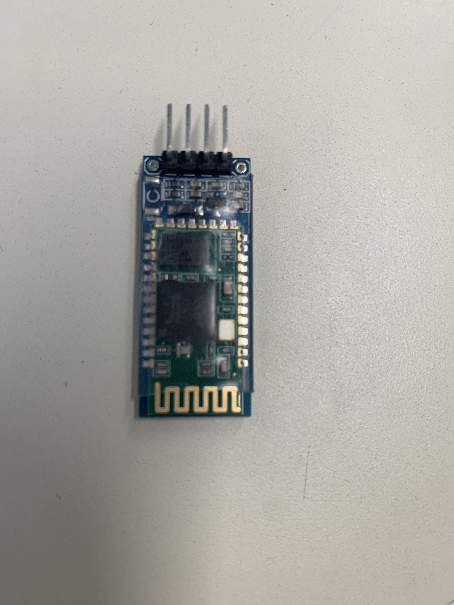
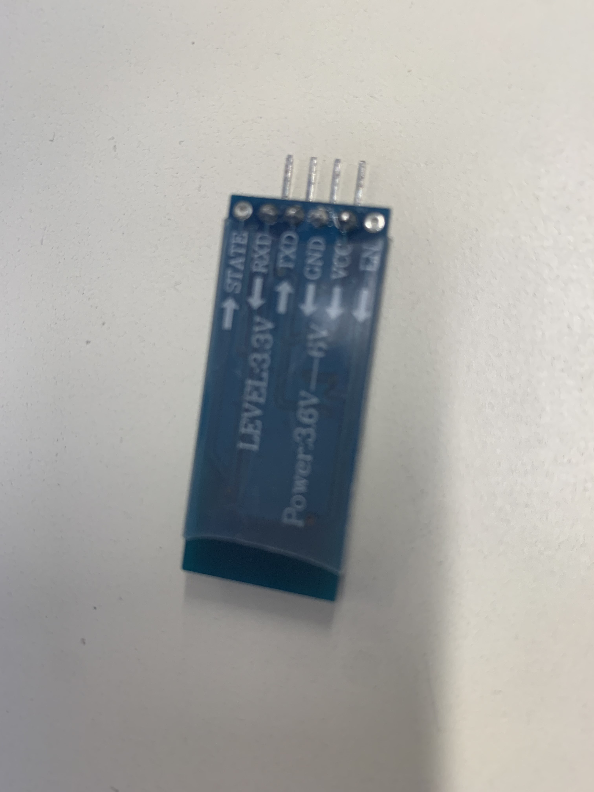

# Rapport de Projet Arduino

## Introduction

Le projet vise à concevoir un véhicule tout-terrain à quatre roues motrices, capable de stocker et de livrer des cargaisons. Le contrôle de ce véhicule se fera via Bluetooth à partir d'un téléphone mobile. Cette initiative s'inscrit dans le cadre de notre exploration des applications pratiques de la technologie Arduino dans le domaine de la robotique et du contrôle à distance.

## Avancements du Jour

Aujourd'hui, une partie significative de notre temps a été consacrée à la modélisation du châssis du véhicule sur la plateforme Onshape. Durant cette séance, nous avons rencontré un défi lié à la réalisation d'une extrusion négative entre deux pièces. Après une recherche approfondie, un professeur nous a éclairés sur la fonctionnalité appropriée, qui se révèle être le "Boolean". Cette avancée nous permettra de finaliser la conception du châssis au cours des vacances à venir.

Parallèlement, des efforts ont été déployés pour comprendre les aspects de la communication Bluetooth. Nous avons acquis un module Bluetooth auprès d'un de nos professeurs, ouvrant ainsi la voie à la prochaine phase du projet.

En outre, des ajustements ont été apportés aux connexions des moteurs sur les conseils d'un professeur. Le réarrangement des câbles dans une orientation différente a été réalisé pour minimiser les risques de dessoudage. Une couche de scotch a été appliquée pour sécuriser davantage les connexions et les maintenir en place.

## Prochaines Étapes

Les prochaines étapes du projet impliquent la finalisation de la modélisation du châssis, la mise en place du module Bluetooth pour la communication sans fil, et la programmation du contrôle via l'application sur téléphone mobile. Ces étapes seront abordées pendant la période des vacances, avec l'objectif de parvenir à une version opérationnelle du véhicule à la fin de cette phase.

Le soutien continu des enseignants a été précieux tout au long du processus, et nous sommes impatients de relever les défis techniques qui nous attendent dans les semaines à venir.

*Note: La terminologie "Bluetooth" a été corrigée conformément à la norme d'orthographe française.*

