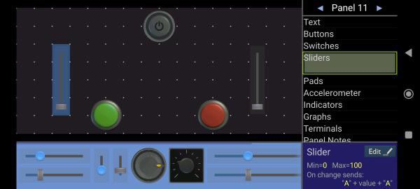
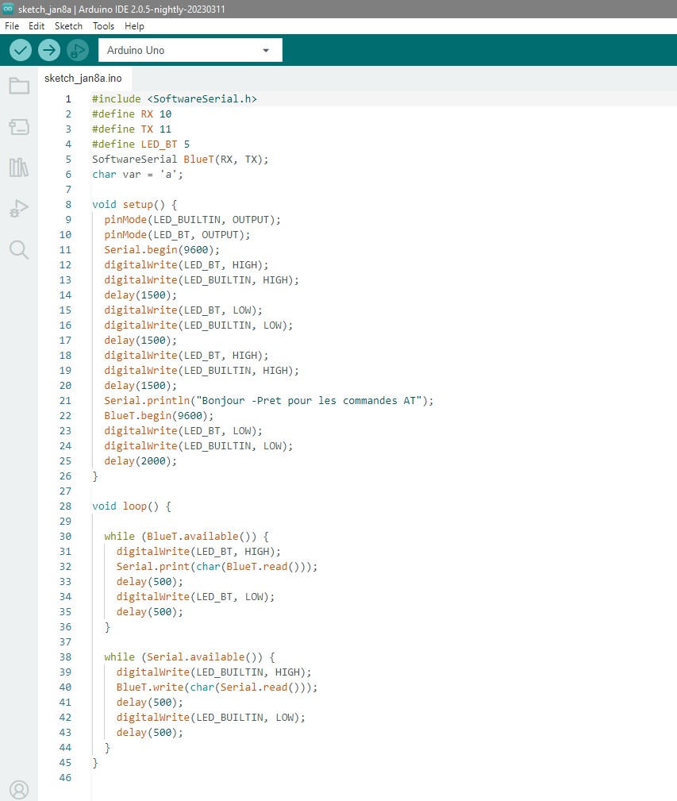

# Rapport de Projet Arduino - Véhicule 4 Roues Motrices Télécommandé par Bluetooth

## Introduction

Le présent rapport documente les étapes initiales de développement du projet visant à créer un véhicule à quatre roues motrices contrôlable par Bluetooth, conçu pour stocker et livrer des cargaisons. L'objectif principal est de permettre le contrôle du véhicule à distance via une connexion Bluetooth à partir d'un smartphone.

## Étapes Accomplies

### 1. Format de l'Application et Messages Bluetooth

Au cours de cette phase, le format de l'application a été élaboré, définissant les messages qui seront émis via Bluetooth pour la communication entre le smartphone et l'Arduino. Cette étape est cruciale pour garantir une communication efficace et cohérente.

### 2. Programmation de la Communication Bluetooth

Le code nécessaire pour établir la communication entre l'Arduino et le module Bluetooth HC-05 a été développé. Cependant, cette étape a présenté des défis significatifs. Malgré les conseils d'un enseignant et des tests effectués avec différents modules, la communication avec un module spécifique n'a pas été réussie.

## Problèmes Rencontrés

Malgré les efforts déployés et l'assistance d'un enseignant, des difficultés majeures ont été rencontrées lors de la programmation de la communication Bluetooth. Malgré des tests sur plusieurs modules, la connexion avec aucun d'entre eux n'a abouti. Cela a nécessité une collaboration supplémentaire avec un camarade de classe, qui a généreusement partagé son code pour être testé lors de la prochaine séance.

## Prochaines Étapes

La prochaine séance de travail consistera à évaluer le code fourni par le camarade de classe pour résoudre les problèmes de communication Bluetooth. Des ajustements et des tests supplémentaires seront effectués pour garantir une connectivité réussie entre l'Arduino et le module HC-05.

Le projet dans son ensemble progresse malgré ces difficultés initiales, et l'équipe reste déterminée à surmonter les obstacles techniques pour atteindre les objectifs fixés.

--- 

 
