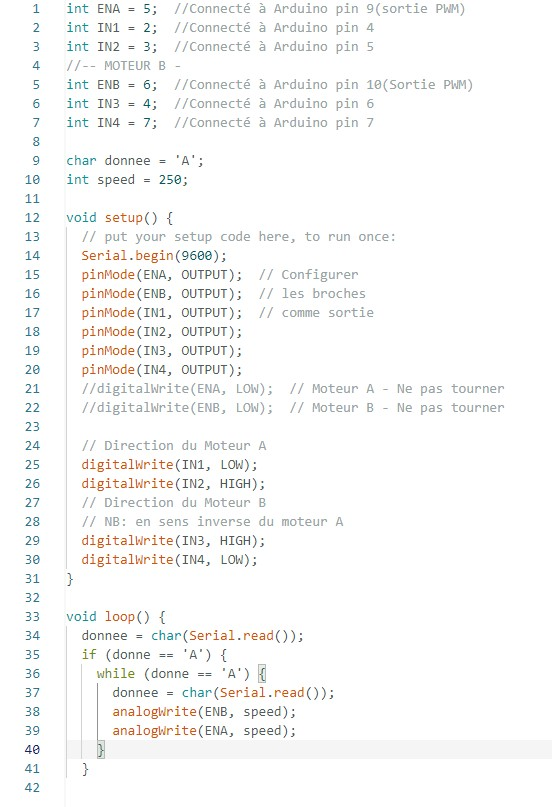

# Rapport de Projet Arduino : Véhicule 4 roues motrices contrôlable par Bluetooth

## Introduction

Le présent rapport documente le projet de création d'un véhicule à quatre roues motrices, conçu pour stocker et livrer des cargaisons. L'aspect novateur de ce projet réside dans la capacité du véhicule à être contrôlé via Bluetooth à partir d'un téléphone portable. Ce rapport détaille les étapes entreprises jusqu'à présent, avec un accent particulier sur la mise en œuvre de la communication Bluetooth et les tests effectués.

## Progrès réalisés

Aujourd'hui, des efforts significatifs ont été déployés pour établir la communication Bluetooth entre le téléphone portable et le véhicule. Malgré la collaboration avec mes camarades, la mise en place de cette communication reste encore sans succès. Dans le but de poursuivre les travaux, j'ai élaboré un programme de simulation qui génère des données Bluetooth, lesquelles sont affichées dans le moniteur série. Ces données sont ensuite utilisées pour actionner les moteurs du véhicule, suivant l'action souhaitée.

## Simulation des Commandes Bluetooth

Le programme développé simule l'arrivée de données Bluetooth en les affichant dans le moniteur série. Ces données déclenchent des actions spécifiques sur les moteurs du véhicule, permettant ainsi de tester différentes fonctionnalités. Les commandes mises en place incluent la possibilité de faire avancer le véhicule tout droit, de le faire stopper, de le faire tourner à droite, à gauche, de le faire reculer, etc.

## Tests et Vérifications

Afin de vérifier l'efficacité du programme, des tests ont été effectués en reconfigurant les branchements des moteurs sur les ponts en H. Cette étape était cruciale pour garantir que les commandes simulées via Bluetooth étaient correctement interprétées par les moteurs du véhicule.

## Prochaines Étapes

Malgré les obstacles rencontrés dans la mise en place de la communication Bluetooth, des démarches supplémentaires seront entreprises pour résoudre ce problème. Les prochaines étapes consisteront à collaborer davantage avec les camarades de projet, à explorer des solutions alternatives, et à ajuster le programme de simulation pour une intégration plus précise des données Bluetooth.

## Conclusion

En dépit des défis rencontrés, le projet avance de manière prometteuse. Les simulations effectuées offrent des perspectives encourageantes pour la suite du développement du véhicule. Les progrès réalisés jusqu'à présent témoignent de l'engagement et de la détermination à surmonter les obstacles techniques.

