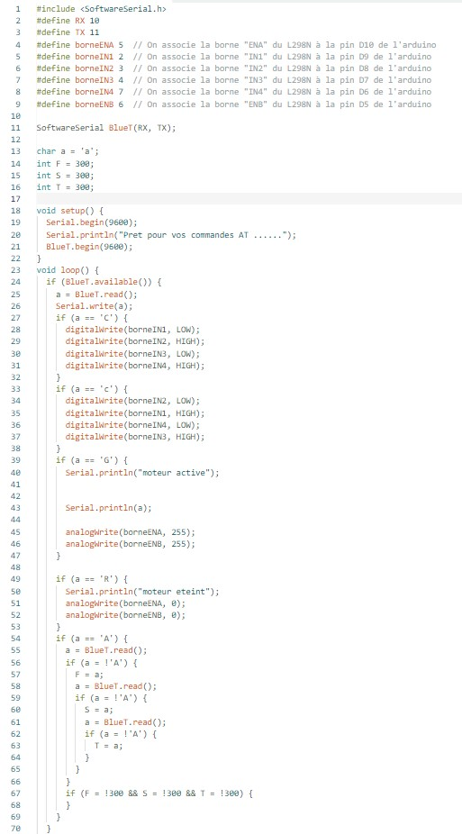

# Rapport de Projet Arduino

## Introduction

Le projet présenté ici vise à concevoir un véhicule tout-terrain à quatre roues motrices capable de stocker et de livrer des cargaisons, contrôlable via Bluetooth depuis un appareil mobile. Cette initiative combine des aspects de robotique, d'électronique et de programmation pour réaliser un système polyvalent et autonome.

## Réalisation du Projet

### Test du Module Bluetooth

Le processus de développement a débuté par des tests visant à vérifier le fonctionnement du module Bluetooth. Après quelques ajustements, une connexion réussie entre le module et le téléphone a été établie, permettant ainsi la communication sans fil.

### Configuration du Pont en H

En parallèle, l'attention s'est portée sur la configuration du pont en H pour le contrôle des deux moteurs. À l'aide d'un voltmètre, chaque connexion a été minutieusement testée. Suite à des difficultés rencontrées, une assistance supplémentaire a été sollicitée auprès d'un enseignant qui a identifié l'alimentation comme source du problème. Une nouvelle batterie a alors été fournie, résolvant ainsi l'obstacle technique.

### Assemblage du Véhicule

Une fois les problèmes d'alimentation résolus, la phase d'assemblage a pu commencer. Deux moteurs ont été fixés au châssis, et une bille a été ajoutée pour fournir un troisième point d'appui, s'inspirant ainsi des principes observés dans les petites voitures autonomes testées lors des travaux dirigés précédents.

### Développement du Code

Enfin, le développement du code a été initié pour traiter les données reçues via Bluetooth depuis le téléphone afin de commander les moteurs. Ce processus implique la programmation d'un ensemble d'instructions pour assurer le fonctionnement coordonné et précis du véhicule.

## Conclusion

En conclusion, le projet Arduino visant à concevoir un véhicule tout-terrain contrôlable par Bluetooth a progressé avec succès malgré quelques obstacles techniques rencontrés en cours de route. La collaboration avec des enseignants et la résolution efficace des problèmes ont permis de surmonter ces difficultés, aboutissant à un système fonctionnel prêt à être optimisé et étendu pour des applications futures.

