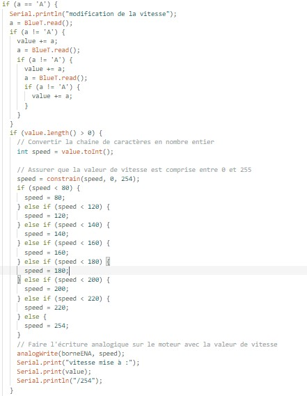

# Projet Arduino - Rapport

## Introduction
Le projet consiste à concevoir un véhicule à quatre roues motrices capable de stocker et de livrer des cargaisons. Ce véhicule est contrôlable via Bluetooth à partir d'un téléphone mobile. L'objectif principal est de créer un système efficace et précis pour contrôler les mouvements du véhicule à distance.

## Description du Projet
Le véhicule est équipé de quatre roues motrices pour assurer une meilleure traction et une meilleure maniabilité. Il est conçu pour transporter des cargaisons de manière autonome, ce qui le rend utile dans diverses applications telles que la logistique et la livraison.

Le contrôle du véhicule se fait à partir d'une application mobile via Bluetooth. L'application permet à l'utilisateur de contrôler la vitesse et la direction du véhicule à l'aide de sliders. Ces sliders envoient des valeurs analogiques au véhicule, qui les interprète pour ajuster la vitesse des moteurs et les mouvements du véhicule.

## Travail Réalisé
Le travail effectué aujourd'hui a principalement porté sur la mise en place du code permettant de contrôler les moteurs du véhicule à l'aide des sliders de l'application mobile. L'objectif était d'optimiser le contrôle des virages pour les rendre plus fluides et précis.

Le code a été conçu pour décomposer les caractères reçus par l'application mobile. L'application envoie des nombres compris entre 0 et 255, bornés par des 'A'. Le code lit ces caractères comme le début d'une information pour les sliders. Il récupère ensuite les caractères du nombre jusqu'à ce qu'il retombe sur un 'A'. Ensuite, il transforme ces caractères en une seule chaîne de caractères, puis en un entier, afin de modifier la vitesse de rotation des moteurs du véhicule.

## Conclusion
Le projet progresse de manière satisfaisante, avec des avancées significatives dans la mise en place du contrôle à distance du véhicule. Le code développé permet une interprétation précise des commandes envoyées par l'application mobile, ce qui garantit un contrôle fluide et efficace du véhicule.

Les prochaines étapes consisteront à finaliser le code de contrôle, à tester le véhicule dans des conditions réelles et à optimiser les performances en fonction des retours d'expérience. Le projet continue de susciter un intérêt croissant, et l'équipe est enthousiaste à l'idée de poursuivre son développement.

