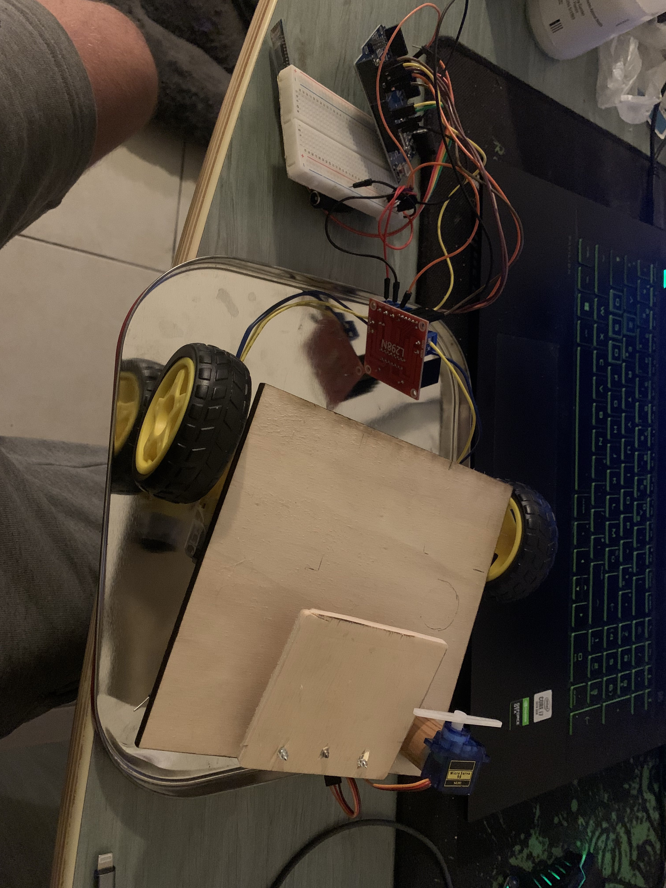

# Rapport de Projet Arduino : Véhicule 4 Roues Motrices Télécommandé

## Introduction
Le présent rapport décrit le projet de création d'un véhicule à quatre roues motrices contrôlable via Bluetooth depuis un téléphone. L'objectif principal de ce projet est de concevoir un véhicule capable de stocker et de livrer des cargaisons, offrant ainsi une solution polyvalente pour diverses applications.

## Description du Projet
Le projet consiste en la création d'un véhicule à quatre roues motrices équipé d'une technologie de communication Bluetooth pour le contrôle à distance. Le véhicule est conçu pour être contrôlé à l'aide d'une application mobile sur un téléphone compatible avec la technologie Bluetooth.

## Développement et Résolution des Problèmes
Lors du développement du projet, plusieurs problèmes ont été rencontrés et résolus pour assurer le bon fonctionnement du véhicule. Parmi ces problèmes, un cas notable concerne la synchronisation des moteurs.

### Problème de Synchronisation des Moteurs
Il a été observé que les deux moteurs du véhicule ne tournaient pas à la même vitesse, ce qui affectait les performances globales du véhicule. Après des tests approfondis, il a été constaté que l'un des moteurs recevait une tension différente de l'autre, même lorsque les deux étaient alimentés par la même source. Par conséquent, il a été déterminé qu'un des moteurs était endommagé et a dû être remplacé. Le remplacement du moteur a résolu le problème de désynchronisation, et les deux moteurs ont ensuite fonctionné à peu près à la même vitesse.

### Problème de Contrôle du Sens de Rotation
Un autre problème rencontré était lié au contrôle du sens de rotation des moteurs. Il a été observé qu'un des moteurs refusait de tourner dans les deux sens et ne pouvait fonctionner que dans une direction. Ce problème persistait même après avoir essayé plusieurs moteurs et ponts en H. Après des tests approfondis, il a été déterminé que le dysfonctionnement était dû à une défaillance de la carte Arduino, qui ne parvenait pas à fournir la tension appropriée à la broche de commande (+5V) pour contrôler le sens de rotation du moteur.

## Conclusion
En conclusion, malgré les défis rencontrés lors du développement du projet, le véhicule à quatre roues motrices contrôlable par Bluetooth a été conçu avec succès. Les problèmes techniques rencontrés ont été résolus grâce à des tests rigoureux et à des solutions appropriées, assurant ainsi le bon fonctionnement du véhicule. Ce projet démontre l'importance de la résolution de problèmes et de la persévérance dans le domaine de l'ingénierie des systèmes embarqués.

